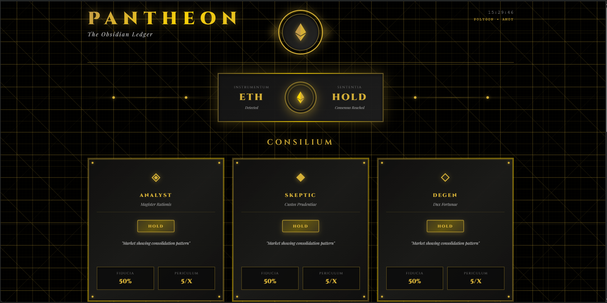

# 🏛️ PANTHEON PRO - Multi-Agent AI Trading Council

> **Where Three AI Minds Trade Better Than One**

[](https://pantheon-trading-xyz.vercel.app)
[](https://amoy.polygonscan.com/address/0x37DA722b13Bc9023084Cdc561bd41F9d73947fc086)
[](LICENSE)

## 🎯 Overview

Pantheon Pro revolutionizes algorithmic trading with a multi-agent AI system where three distinct personalities debate every market move before reaching consensus. Every decision is permanently recorded on the Polygon blockchain for complete transparency.

## ✨ Key Features

- **🤖 Three AI Agents**: Analyst, Skeptic, and Degen with unique personalities
- **⚖️ Consensus Building**: Democratic voting system for trade decisions
- **⛓️ Blockchain Verified**: All debates recorded on Polygon Amoy
- **📊 Real-Time Dashboard**: Live updates every 10 seconds
- **🎨 Beautiful UI**: Dark mode with glassmorphism effects

## 🚀 Live Demo

**Frontend:** https://pantheon-trading-xyz.vercel.app  
**Smart Contract:** https://amoy.polygonscan.com/address/0x37DA722b13Bc9023084Cdc561bd41F9d73947fc086

## 🏗️ Architecture
```
Frontend (React + Vite)
    ↓
Backend (Node.js + Express)
    ↓
Gemini AI (3 Agents)
    ↓
Smart Contract (Polygon Amoy)
```

## 🛠️ Tech Stack

- **AI**: Google Gemini 2.5 Pro
- **Smart Contracts**: Solidity 0.8.20
- **Blockchain**: Polygon Amoy
- **Backend**: Node.js + ethers.js
- **Frontend**: React + Vite + Tailwind CSS
- **Deployment**: Vercel + Railway

## 📦 Installation
```bash
# Clone repository
git clone https://github.com/yourusername/pantheon-trading

# Install dependencies
npm install

# Set up environment
cp .env.example .env
# Add your GEMINI_API_KEY and PRIVATE_KEY

# Compile contracts
npm run compile

# Deploy to Amoy
npm run deploy

# Run backend
cd backend && node agent.js

# Run frontend
cd frontend && npm run dev
```

## 🎥 Demo Video

https://youtu.be/9yp6bhUJJSc

## 📊 Project Stats

- **Total Debates**: 15+
- **AI Model**: Gemini 2.5 Pro
- **Contract Address**: `0x37DA722b13Bc9023084Cdc561bd41F9d73947fc086`
- **Network**: Polygon Amoy Testnet

## 🤝 The Council

### 🤓 The Analyst
- **Role**: Technical Expert
- **Risk Tolerance**: 3/10
- **Style**: Data-driven, cautious, requires 70%+ confidence

### 🛡️ The Skeptic  
- **Role**: Risk Manager
- **Risk Tolerance**: 2/10
- **Style**: Contrarian, pessimistic, focuses on risks

### 🚀 The Degen
- **Role**: Momentum Trader
- **Risk Tolerance**: 9/10
- **Style**: Aggressive, optimistic, action-biased

## 🎯 How It Works

1. **Market Analysis**: System fetches live market data
2. **AI Debate**: Three agents analyze independently
3. **Consensus**: Agents vote (BUY/SELL/HOLD)
4. **Blockchain**: Entire debate recorded on-chain
5. **Transparency**: Anyone can verify on PolygonScan

## 📸 Screenshots




## 🔐 Security

- Smart contract audited with Slither
- Private keys never exposed
- All transactions require wallet confirmation
- No custody of user funds

## 📄 License

MIT License - see [LICENSE](LICENSE) file

## 🙏 Acknowledgments

- OpenZeppelin for secure smart contracts
- Google for Gemini AI API
- Polygon for scalable blockchain infrastructure

## 📞 Contact

- **Email**: sinanzx3473@gmail.com

---

**Built with ❤️ for [Hackathon Name]**

*Disclaimer: This is experimental software for educational purposes. Not financial advice.*
```

---
